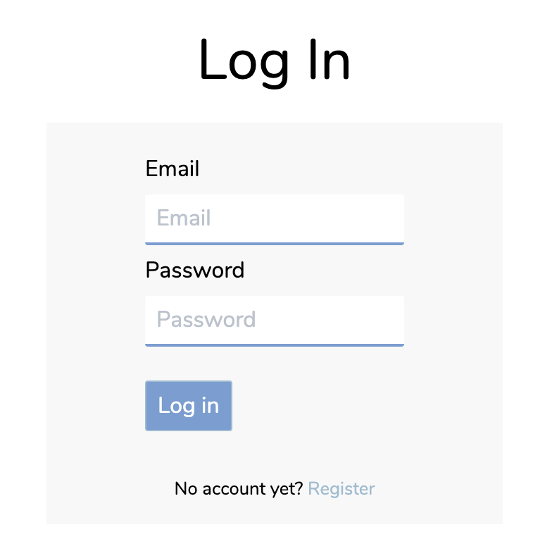
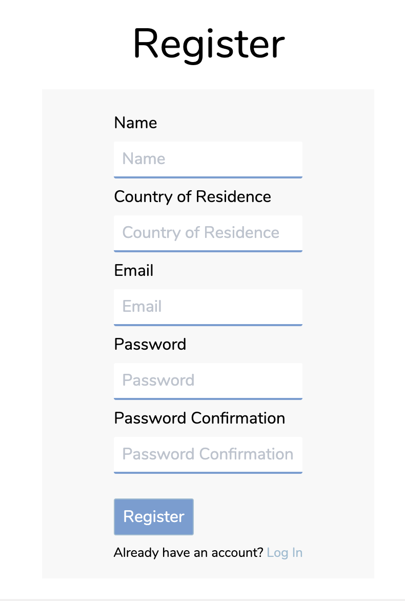

# GA Project 4 - Team JAMM Travels

Team JAMM travels is Family Travel Blog, inspired by my desire to document my families travels. Team JAMM is a nickname we've developed for ourselves based on the first letters of each of our names.

## Built With

* HTML5
* SCSS
* Spectre CSS Framework
* JavaScript
* Python
* Django
* React
* Node
* Express
* Insomnia
* Yarn
* Git / GitHub

## Timeframe

1 Week solo project

## Deployment

This website is deployed on [Heroku](https://team-jamm-travels.herokuapp.com)

---

## Getting Started

Use the clone button to download the source code. In your terminal enter the following commands:

### To install all the packages listed in the package.json:
$ yarn

### Run the app on your localhost:
$ yarn start

---

## User Experience

The first thing you see on the homepage is a clean, uncrowded navigation bar and a large family photograph. 


Upon scrolling down, the inital image fades out until information about Team JAMM Travels and 'cards' about each blog are displayed. Each card shows the blog title, a short subtitle and the main blog image.

Scrolling down further another large moving image is displayed, followed by a 'featured blogs' section. The page is finished off with a bottom navigation bar linking to About, FAQ and Contact Pages.

If a blog is opened the view is as follows:


The blog heading, date of publication and images are displayed on the left hand side with blog subtitle, author name, blog post and appropriate story tags displayed on the right hand side.

If a user has registered and logged in to their own account using the below forms accessible from the navigation bar




They are able to leave comments on blog posts, users may also delete comments they have made.

---

## Challenges

The challenges associated with this project were:

* Using Python and Django for the first time
* Getting the user authentication working
* Uploading images

---

## Wins

The wins associated with this project were:

* Linking the main hom page image opacity to the Y axis scroll percentage on the window

```js
class Home extends React.Component {
  constructor() {
    super()

    this.state = {
      currentScrollHeight: 0,
    }

  }

  componentDidMount() {
    window.onscroll = () => {
      const newScrollHeight = Math.ceil(window.scrollY / 20) * 8
      if (this.state.currentScrollHeight !== newScrollHeight) {
        this.setState({ currentScrollHeight: newScrollHeight })
      }
    }
  }

<div style={{ opacity }} className="parallax"></div>
```

* Ensuring that a maximum of blogs appeared in the 'featured blogs' section for aesthetic purposes

```js
<div className="featured-blogs-wrapper">
  {blogs.slice(0, 4).map(blog => (
    <Link to={`/blogs/${blog.id}`}  key={blog.title}>
      {blog.images.length > 0 ?
        <div className="featured-blogs">
          </img>
          <h6 className="centre">{blog.title}</h6>
        </div>
        : ''}
    </Link>
  ))}
</div>
```
* The simple, beautiful styling on the form inputs

```css
input.form-input {
  border: none;
  border-bottom: #739DD3 2px solid;
}
```

* The addition of a moving image on the homepage

```js
<div className="cinemagraph centre">
  <video autoPlay loop>
    <source src="https://i.imgur.com/gOsHPsX.mp4" type="video/mp4" />
    Your browser does not support the video tag.
  </video>
</div>
```

---

## Key Learning Points

The key learning points associated with this project were:

* How to work with an SQL database
* Lifting my styling and presentation skills to the next level
* Increasing my knowledge of getting the back and front end's of a project working together

---

## Future Improvements

This project was really fun and personal to me and I'm really proud of the progress I made in the alloted time. Being so personally invested however means I have a lot of additional ideas to improve the website which I hope to implement at a later date.

Advancements that could be made in the future to improve this website include:

- Being able to upload new blog post images through the front-end
- Ability to edit user comments as well as delete them
- Blog post tags linking to other blog posts with the same tag

## Author - Mary-Anne Triggs

Please visit my personal [portfolio](www.maryannetriggs.com)
